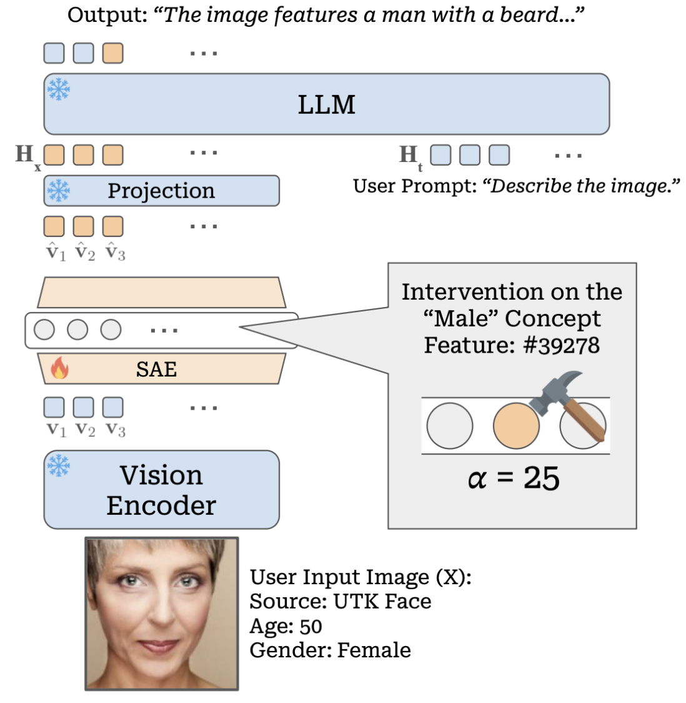
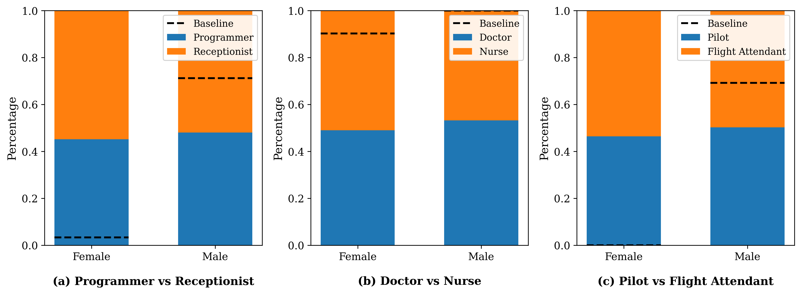
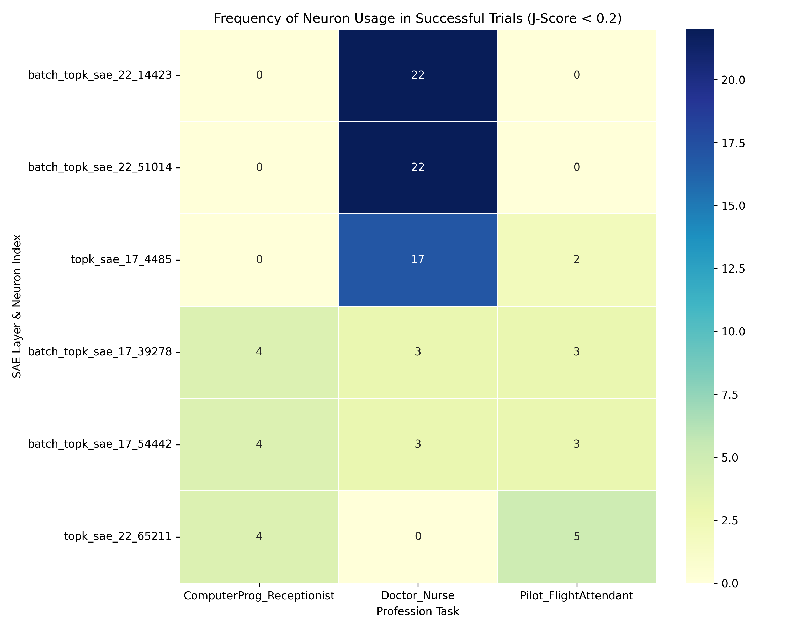
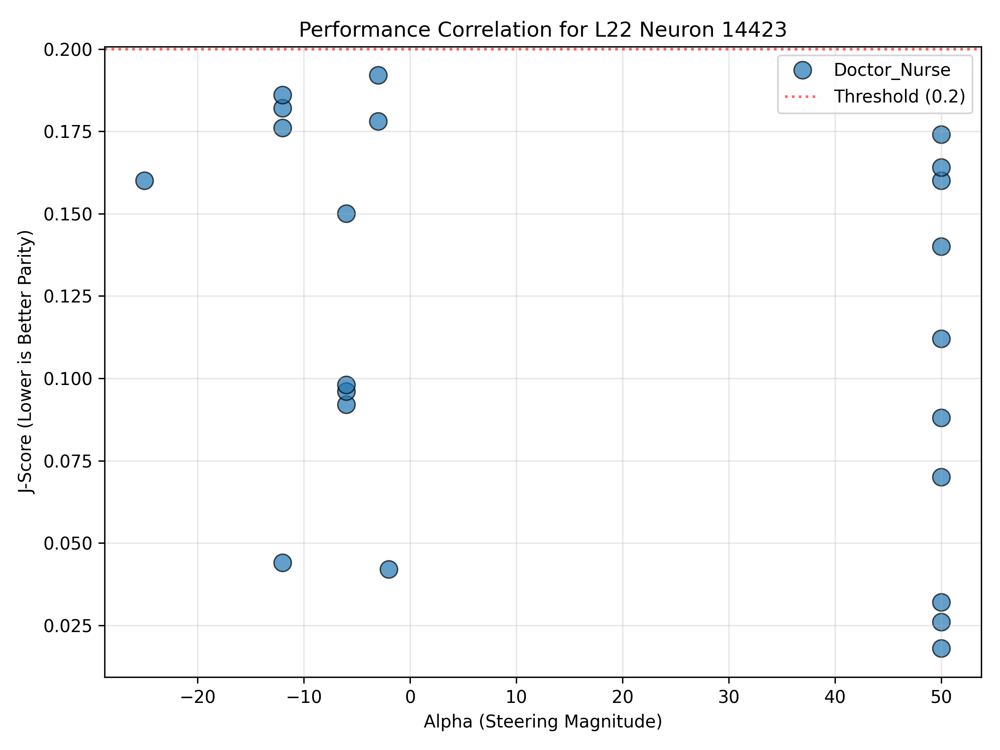
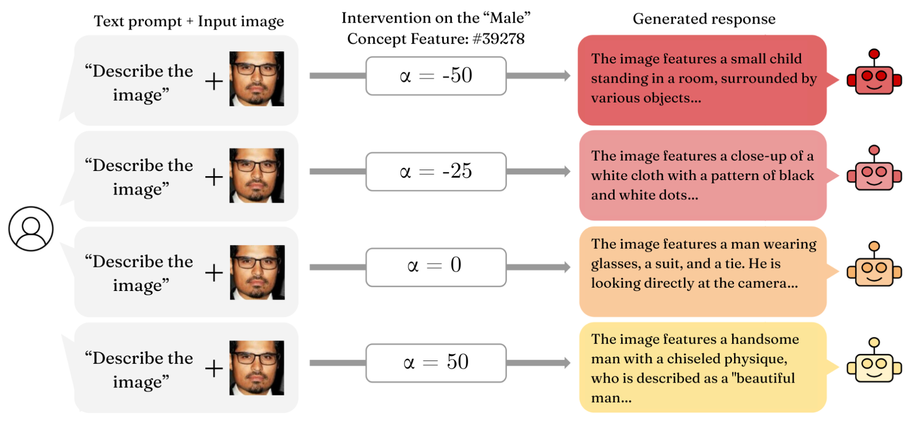

# Decoding Bias in Vision-Language Models using Sparse Autoencoders (Master's Thesis)

This repository contains the codebase and implementation for my Master's Thesis: **"Sparse Autoencoders for Vision Language Models"** submitted at **Leibniz Universität Hannover** (Institute for Data Science / Forschungszentrum L3S).

* **Author:** Abhishek Agrawal
* **Supervised By / First Examiner:** Dr. Sandipan Sikdar
* **Second Examiner:** Prof. Dr. techn. Wolfgang Nejdl
* **Date:** 11. May 2026

---

## Thesis Abstract & Core Contributions

Vision-Language Models (VLMs) like LLaVA-1.5-7B exhibit severe zero-shot demographic and occupational bias due to spurious correlations inherited from training datasets. Traditional debiasing methods rely on resource-intensive model fine-tuning or brittle prompt engineering.

This work proposes a **parameter-efficient, inference-time approach** to audit and neutralize occupational gender bias using targeted concept steering via **Sparse Autoencoders (SAEs)**.

<p align="center">
  
  <br>
  <em>Figure: Overview of SAE-based concept steering. The autoencoder intercepts dense activations in the vision tower, projects them to sparse latents, applies clamping interventions, and decodes back to the VLM residual stream.</em>
</p>

### Key Methodological Contributions:
1. **Architectural Comparison (Top-K vs. Batch Top-K):** Evaluates SAE feature disentanglement across multiple depths of the CLIP vision tower. Proves that the dynamic capacity allocation of Batch Top-K architectures is superior in maintaining VLM representational fidelity.
2. **Information-Theoretic Concept Localization:** Formulates a novel evaluation pipeline pairing **Signed Mutual Information (Signed-MI)** with an **Activation Consistency (AC) filter**. This successfully isolates gender-encoding latents on uniform datasets, bypassing the mathematical bottlenecks of continuous cosine similarity metrics (like the MS-Score).
3. **Causal Bipolar Concept Steering:** Implements a PyTorch hook-based intervention that surgically clamps target concept features during the forward pass. Demonstrates that overcoming the deep-seated language priors of the LLM backend requires **bipolar steering** (forcefully pushing the visual tokens in the opposite direction).

<p align="center">
  
  <br>
  <em>Figure: Comparison of zero-shot VLM occupational predictions at baseline vs. post-steering parity.</em>
</p>

---

## Key Quantitative Results

### 1. Structural Reconstruction Fidelity (ImageNet)
Our Batch Top-K SAE implementation achieves higher explained variance ($R^2$) and lower Mean Squared Error (MSE) compared to traditional architectures, exceeding contemporary visual-modality baselines (e.g. Pach et al., 2025):

| Layer | Architecture | $L_0$ | MSE | $R^2$ (%) | Baseline $R^2$ (%) |
| :--- | :--- | :--- | :--- | :--- | :--- |
| **Layer 11** | Top-K <br> **Batch Top-K** | 20.00 <br> **19.32** | 0.016 <br> **0.016** | 77.10 <br> **77.26** | - <br> 73.50 |
| **Layer 17** | Top-K <br> **Batch Top-K** | 20.00 <br> **19.34** | 0.028 <br> **0.027** | 89.36 <br> **89.81** | - <br> 72.50 |
| **Layer 22** | Top-K <br> **Batch Top-K** | 20.00 <br> **20.13** | 0.096 <br> **0.094** | 87.93 <br> **88.20** | - <br> 77.40 |

### 2. Isolated Gender-Concept Latents (UTKFace $D_{ident}$)
Using Signed-MI combined with a mutual exclusivity constraint ($\tau \ge 0.1$, $\text{noise floor} > 0.05$), we isolated the top-performing demographic features:

| Target | Architecture | Layer | Feature ID | Signed-MI | Target Fires | Other Fires | Avg Tgt Act | Avg Oth Act |
| :--- | :---: | :---: | :---: | :---: | :---: | :---: | :---: | :---: |
| **Male** | BTK <br> BTK | 17 <br> 22 | **39278** <br> **14423** | -0.236 <br> -0.186 | 1251 <br> 1230 | 8 <br> 86 | 0.42 <br> 0.99 | 0.00 <br> 0.02 |
| **Female** | BTK <br> TK <br> BTK <br> TK | 22 <br> 22 <br> 17 <br> 17 | **51014** <br> **65211** <br> **54442** <br> **4485** | 0.159 <br> 0.156 <br> 0.092 <br> 0.092 | 1661 <br> 1580 <br> 991 <br> 1078 | 44 <br> 31 <br> 17 <br> 36 | 1.03 <br> 0.97 <br> 0.24 <br> 0.25 | 0.02 <br> 0.02 <br> 0.01 <br> 0.01 |

<p align="center">
  
  <br>
  <em>Figure: Activation frequency of target gender-concept neurons across successful Slurm evaluation runs.</em>
</p>

### 3. Debiasing Performance via Optuna sweeps (UTKFace $D_{test}$)
By minimizing the $J\text{-Score}$ representing cumulative absolute deviation from perfect demographic parity ($0.5$), our interventions reduced occupational bias close to zero without inducing logit collapse.
* **Pilot / Flight Attendant:** The baseline model originally predicted **0.0%** female pilots. Our steering successfully corrected this exclusion to **46.4%**, dropping the J-score to **0.038**.

| Occupation Pairs | Architecture & Layer | Feature Index (Concept) | Clamping $\alpha$ | Post-Intervention $J\text{-Score}$ |
| :--- | :--- | :--- | :---: | :---: |
| **Programmer / Receptionist** | BTK Layer 17 <br> BTK Layer 17 <br> TK Layer 22 | 39278 (Male) <br> 54442 (Female) <br> 65211 (Female) | -50.0 <br> -2.0 <br> -1.0 | **0.068** |
| **Doctor / Nurse** | TK Layer 17 <br> BTK Layer 22 <br> BTK Layer 22 | 4485 (Female) <br> 14423 (Male) <br> 51014 (Female) | -3.0 <br> -2.0 <br> 12.0 | **0.042** |
| **Pilot / Flight Attendant** | TK Layer 17 <br> TK Layer 22 | 4485 (Female) <br> 65211 (Female) | -50.0 <br> 2.0 | **0.038** |

<p align="center">
  
  <br>
  <em>Figure: Scatter plot illustrating J-Score optimization vs. clamping strength alpha.</em>
</p>

<p align="center">
  
  <br>
  <em>Figure: Qualitative effect of varying clamping strength alpha on the model's text generation (ranging from standard behavior to correct steering, and eventually catastrophic logit collapse at extreme values).</em>
</p>

---

## Modular Structure

The codebase is organized as follows:
* **[src/config.py](src/config.py)**: Central config loader and autoencoder hyperparameters.
* **[src/models.py](src/models.py)**: Loaders for the VLM (`load_vlm`) and SAE architectures (`load_sae`).
* **[src/data.py](src/data.py)**: Datasets handling lazy loading for HDF5 activations and `UTKFaceDataset` attribute extraction.
* **[src/metrics.py](src/metrics.py)**: Implementations for the Mono-Semanticity Score (`compute_ms_scores`) and Signed Mutual Information (`compute_signed_mutual_information`).
* **[src/steering.py](src/steering.py)**: Vectorized forward hook clamping steerer (`SAEHookSteerer`).
* **[src/evaluation.py](src/evaluation.py)**: Batched zero-shot VLM occupational bias evaluation loop.

---

## Usage Guide

### 1. Extract Activations
Extract random visual patch tokens or CLS tokens from specified encoder layers:
```bash
python3 run_extract_activations.py \
    --dataset_type utkface \
    --data_dir /path/to/utkface/train/ \
    --output_file data/llava_utkface_patch_multiple_layers_train.h5 \
    --batch_size 256
```

### 2. Train or Fine-tune SAEs
Train models from scratch or fine-tune checkpoints to prevent catastrophic forgetting of ImageNet visual features:
```bash
# Fine-tune layer 17 TopK SAE
python3 run_sae_training.py \
    --mode finetune \
    --data_path data/llava_utkface_patch_multiple_layers_train.h5 \
    --layer layer_17 \
    --pretrained_model_path weights/TopKSAE_training_set_layer_17.pth \
    --save_path weights/TopKSAE_layer_17_UTK_finetuned.pth \
    --sae_type topk \
    --epochs 200
```
My Trained SAEs are available on HuggingFace: [abhishek-040010/sae-for-vlms](https://huggingface.co/abhishek-040010/sae-for-vlms)

### 3. Metric Computations & Concept Discovery
Find demographic concept directions using Signed-MI or evaluate visual purity using MS-Score:
```bash
# Calculate gender-concept Signed Mutual Information (Signed-MI)
python3 run_ms_score.py \
    --metric signed_mi \
    --data_path data/llava_utkface_patch_multiple_layers_train.h5 \
    --layer layer_22 \
    --sae_path weights/TopKSAE_layer_22_UTK_finetuned.pth \
    --sae_type topk \
    --tau 0.7
```

### 4. Perform Activation Steering
Intervene directly on VLM layers at test time using single/multi-neuron interventions or search the parameter space using Optuna sweeps:
```bash
# Run standard evaluation under concept steering
python3 run_steering_experiment.py \
    --mode standard \
    --utk_image_dir /path/to/utkface/test/ \
    --sae_paths batch_topk_sae_17=weights/ae_17.pt \
    --sae_type batch_topk \
    --interventions batch_topk_sae_17:39278:-40 \
    --output_csv steered_predictions.csv

# Optimize J-Score using Optuna TPE sampler
python3 run_steering_experiment.py \
    --mode optuna \
    --utk_image_dir /path/to/utkface/test/ \
    --sae_paths batch_topk_sae_17=weights/ae_17.pt batch_topk_sae_22=weights/ae_22.pt \
    --sae_type batch_topk \
    --optuna_trials 100
```

---

## Academic Citation

If you use this codebase or refer to the findings in the thesis, please cite:

```bibtex
@mastersthesis{agrawal2026sparse,
  author       = {Abhishek Agrawal},
  title        = {Sparse Autoencoders for Vision Language Models},
  school       = {Leibniz Universität Hannover},
  year         = {2026},
  month        = {May},
  type         = {Master's Thesis},
  institution  = {Institute for Data Science / Forschungszentrum L3S},
  supervisor   = {Dr. Sandipan Sikdar},
  examiner     = {Dr. Sandipan Sikdar and Prof. Dr. techn. Wolfgang Nejdl}
}
```
